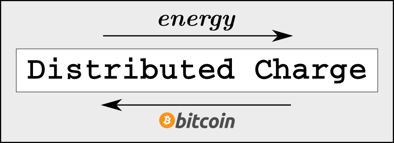

[Distributed Charge](http://AndySchroder.com/DistributedCharge/)
================================================================
## Creating a Bitcoin Lightning Network Enabled Energy Grid ##
  
  
_______________________________________________________________________________

_______________________________________________________________________________
  
  
The distributed charge project was established to make bitcoin the native payment method of the energy grid by creating hardware devices, open source software, and standard protocols for negotiating real time energy pricing and micropayment between machines, on every corner of the earth.

Every electric meter should allow for bi-directional payment and energy flows, and everyone should be able to easily buy and sell energy privately without the need to involve third parties or inflationary monetary systems. 
  
  
_______________________________________________________________________________

Current Implementations And Use Cases
-------------------------------------

### EV: Electric Car Charging
 - Parking lots where the property owner submeters and allows electric cars to charge.

### GRID: General Purpose Electric Metering
 - Rental property where the landlord submeters to a tenant.
 - Independent power producer selling directly to a neighboring property.
  
  
________________________________________________________________

[Change Log](CHANGES.md)
------------------------
  
  
________________________________________________________________

Style Notes
-----------

- The code is written in Python.
- There are some formatting/style issues that could be considered non-standard.
   - Indentations utilize tabs rather than a series of spaces.
   - A tab is assumed to be equivalent to 8 characters.
   - Lines are also often times over 300 characters long, rather than 80 characters which is used by some programmers. This assumes you are using a high resolution screen.
   - Comments that are not indented with the code that they accompany are usually done so to stand out and indicate some deficiency, simplification, or assumption that could be improved.
  
  
________________________________________________________________

Assembly and Installation Instructions
--------------------------------------

- Coming Soon!
  
  
________________________________________________________________

Copyright
---------

Copyright (c) 2024, [Andy Schroder](http://AndySchroder.com)
  
  
________________________________________________________________

License
-------

Permission is hereby granted, free of charge, to any person obtaining a copy of this software and associated documentation files (the "Software"), to deal in the Software without restriction, including without limitation the rights to use, copy, modify, merge, publish, distribute, sublicense, and/or sell copies of the Software, and to permit persons to whom the Software is furnished to do so, subject to the following conditions:

The above copyright notice and this permission notice shall be included in all copies or substantial portions of the Software.

THE SOFTWARE IS PROVIDED "AS IS", WITHOUT WARRANTY OF ANY KIND, EXPRESS OR IMPLIED, INCLUDING BUT NOT LIMITED TO THE WARRANTIES OF MERCHANTABILITY, FITNESS FOR A PARTICULAR PURPOSE, AND NONINFRINGEMENT. IN NO EVENT SHALL THE AUTHORS OR COPYRIGHT HOLDERS BE LIABLE FOR ANY CLAIM, DAMAGES OR OTHER LIABILITY, WHETHER IN AN ACTION OF CONTRACT, TORT, OR OTHERWISE, ARISING FROM, OUT OF OR IN CONNECTION WITH THE SOFTWARE OR THE USE OR OTHER DEALINGS IN THE SOFTWARE.
  
  
________________________________________________________________

